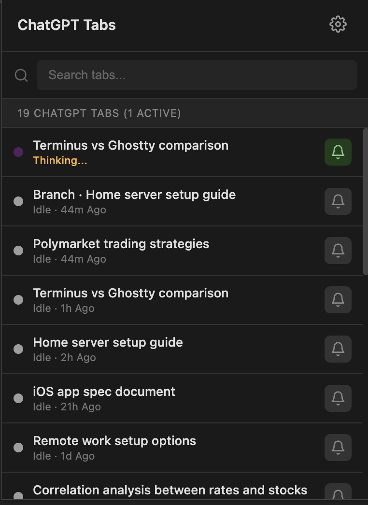
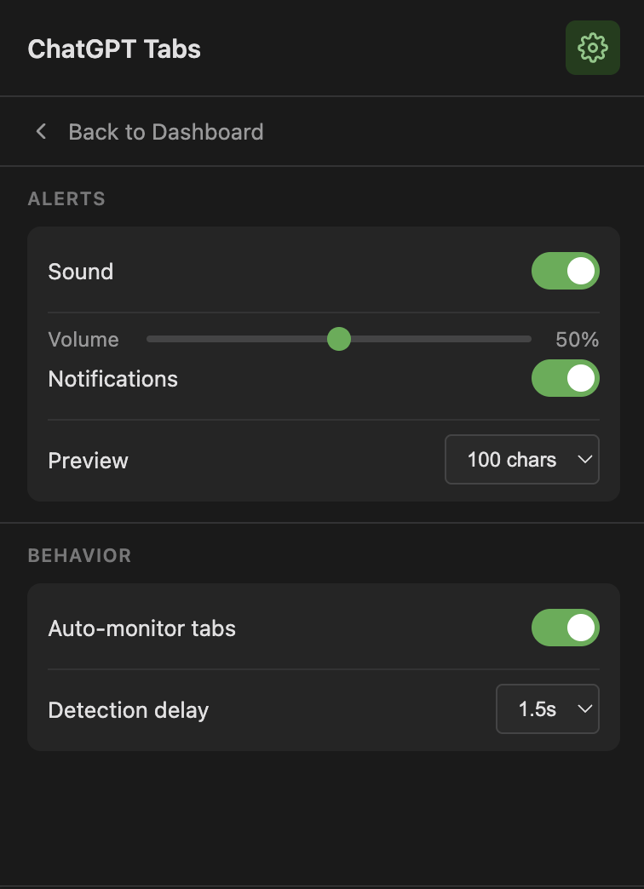

# ChatGPT Completion Notifier

Chrome extension that monitors your ChatGPT tabs in a popup dashboard and notifies you when a response finishes generating. Great for switching tabs while you wait.

## Features

- 🗂️ **Tab dashboard** - list all open ChatGPT tabs (across windows)
- 🔎 **Search + click to focus** - quickly jump to the right conversation
- 🟠 **Live state tracking** - Idle / Generating / Thinking / Writing / Completed
- ⏱️ **Timestamps & timers** - relative “Idle · 5m ago” + live elapsed timer while generating
- 🔔 **Notifications per tab** - toggle alerts with the bell icon, plus optional auto-monitor
- 💬 **Desktop notifications** with response preview
- 🔊 **Sound alert** when response completes
- 🧷 **Badge shows active sessions** - number of currently generating/thinking/writing ChatGPT tabs
- 🌙 **Dark mode** support (follows system theme)
- ⚙️ **Configurable** - adjust volume, preview length, detection timing

## Screenshots

  
  

## Installation

1. Download or clone this repository
2. Open Chrome and go to `chrome://extensions/`
3. Enable "Developer mode" (toggle in top right)
4. Click "Load unpacked" and select the extension folder
5. Open [ChatGPT](https://chatgpt.com) - monitoring starts automatically

> **macOS users:** Make sure Chrome notifications are enabled in System Settings → Notifications → Google Chrome

## How It Works

The extension watches for ChatGPT's "Stop" button. When it disappears and the response text stabilizes (after a configurable delay), you get notified.

It also tracks each tab's state and last activity time for the popup dashboard.

## Settings

Click the extension icon to configure:

| Setting | Description |
|---------|-------------|
| Sound | Enable/disable audio alert |
| Volume | Adjust alert volume |
| Notifications | Enable/disable desktop notifications |
| Preview | Characters to show in notification (0-200) |
| Auto-monitor | Automatically watch new ChatGPT tabs |
| Detection delay | Wait time before confirming completion |

## Privacy

This extension:

- Runs entirely locally
- Does not collect or transmit any data
- Only activates on `chatgpt.com` and `chat.openai.com`
- Source code is fully available for review
